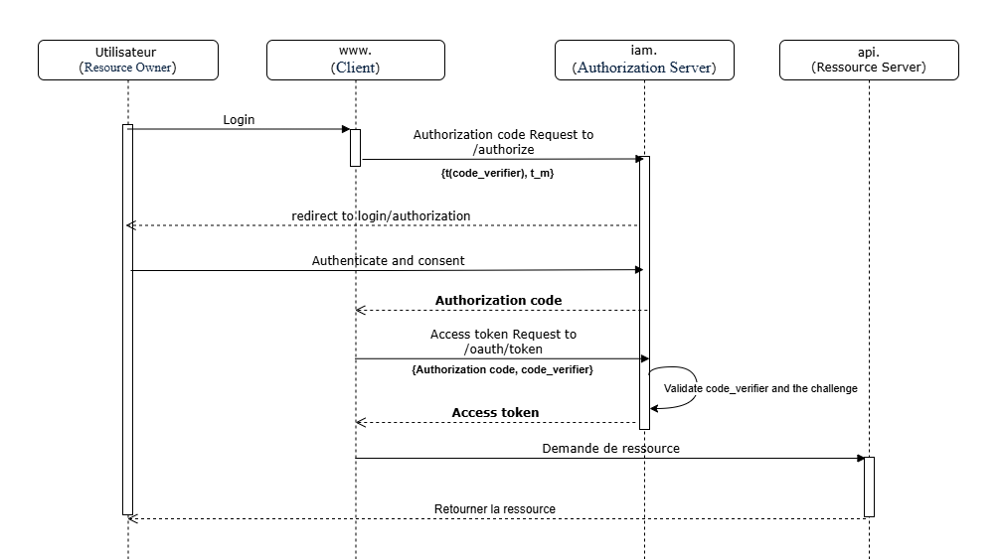
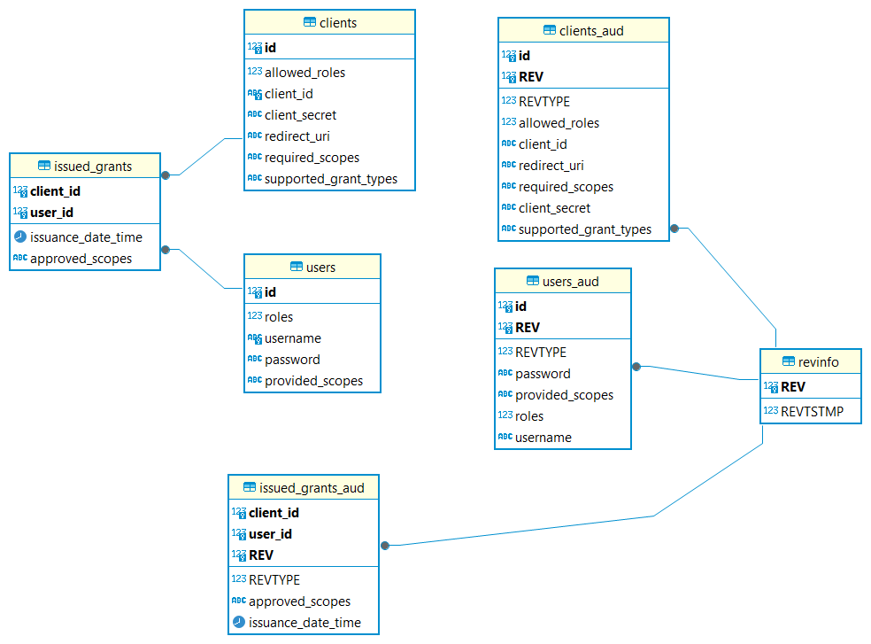

# Steganography AppSec

## Introduction
Le projet **"Steganography AppSec"** s'inscrit dans le cadre d'un projet académique pour la matière **"AppSec"** durant la deuxième période du cinquième semestre à SUP'COM pour l'option **"CYSED"**. Ce projet a pour objectif de mettre en œuvre les différentes caractéristiques fondamentales de la sécurité des informations :

- 🔒 **Confidentialité** : Assurer que les informations ne sont accessibles qu'aux personnes autorisées.
- ✅ **Authenticité** : Garantir l'identité des entités impliquées dans la communication.
- 🔑 **Authentification** : Vérifier l'identité des utilisateurs ou des systèmes.
- 🛡️ **Autorisation** : Réguler les droits d'accès aux ressources.
- 📝 **Journalisation (non-répudiation)** : Enregistrer les événements pour permettre leur traçabilité et éviter les contestations.

## Outils Utilisés

#### Environnement de Développement
- 💻 **IDE** : IntelliJ IDEA

#### Langage de Programmation
- ☕ **Java** : Version 21 (JDK 21)

#### Frameworks et Spécifications
- 📦 **Jakarta EE** : Version 10.0.0  
  - Spécification utilisée : `jakarta-restful-ws-spec-3.1`

#### Serveur d’Application
- 🌐 **WildFly** : Version 34.0.0 (JBoss)

## Description des Parties

### 🔒 Confidentialité
 La confidentialité a été assurée en mettant en place TLS 1.3 sur un serveur Ubuntu. Pour ce faire, un certificat TLS a été généré via Let's Encrypt à l'aide de Certbot, avec les options suivantes :
- HSTS (HTTP Strict Transport Security) : Force les navigateurs à n'accéder au site qu'en HTTPS.

-  CAA (Certification Authority Authorization) : Limite les autorités de certification autorisées à émettre des certificats pour le domaine, réduisant les risques d'attaques par certificats malveillants.

- OCSP stapling (Online Certificate Status Protocol) : Améliore l'efficacité de la vérification des certificats TLS en incluant directement la réponse de validation dans le handshake TLS.

### ✅ Authenticité
 Pour garantir l'authenticité des données, plusieurs techniques ont été évaluées :
- Stéganographie : Permet de cacher un message secret dans des fichiers multimédias.
- Watermarking : Protège les droits d’auteur en insérant des informations dans les données.
- Fingerprinting : Permet d'identifier les copies illégales d'un fichier.

La stéganographie a été choisie en utilisant l'algorithme **LSB** (Least Significant Bit) associé à un **mot secret**. Cette approche est compatible avec les formats d'image JPEG, JPG, et PNG.

### 🔑 Authentification et Autorisation
 L'authentification et l'autorisation ont été implémentées en utilisant le protocole **OAuth 2.0** avec le **Authorization Code Flow with PKCE**. Cette méthode protège contre les attaques visant à intercepter le code d'autorisation.

Nous avons utilisé **AEAD** (Authenticated Encryption with Associated Data) pour intégrer le code challenge dans le code d'autorisation, en utilisant l'algorithme CHACHA20-Poly1305.
##### Gestion des mots de passe
-  Hash côté client : Un hash SHA3-512 est utilisé pour combiner un sel statique et le mot de passe de l'utilisateur. Cela augmente l'entropie du mot de passe et donc renforce la sécurité en prévenant les attaques basées sur les dictionnaires.

- Hash côté serveur : Un hash Argon2 est appliqué en utilisant un sel dynamique et le hash généré côté client. Cette méthode offre une résistance accrue contre les attaques par force brute grâce à ses propriétés d'adaptabilité et de mémoire intensive.

### 📝 Journalisation (Non-répudiation)
 Pour assurer une traçabilité, **Hibernate Envers** a été utilisé pour suivre les modifications des entités `users`, `clients` et `grants` sur le serveur IAM. Les enregistrements incluent :

- L’identité de l’utilisateur ayant effectué les modifications.

- L’heure de la modification.

- Les données modifiées.

## Preview

## Ressources
- [RFC 7636](https://datatracker.ietf.org/doc/html/rfc7636)
- [RFC 6749](https://datatracker.ietf.org/doc/html/rfc6749)
- [RFC 7517](https://datatracker.ietf.org/doc/html/rfc7517)
- [JEP 329: ChaCha20 and Poly1305 Cryptographic Algorithms](https://openjdk.org/jeps/329)

